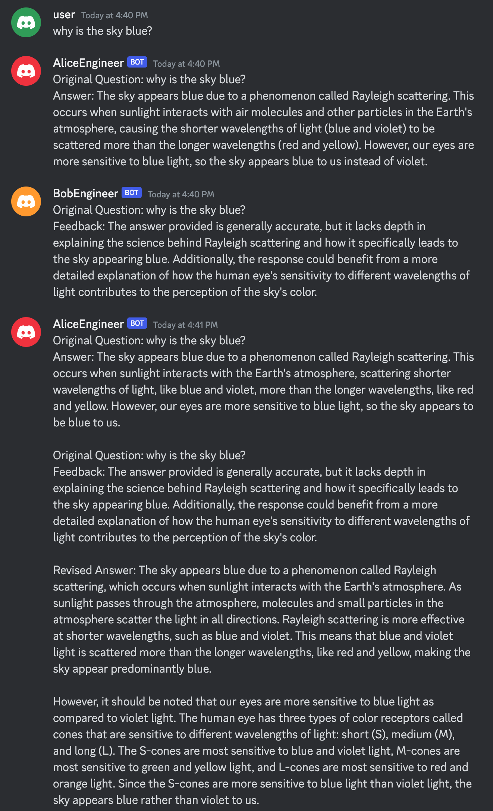

# discord_llms
Experiments in letting large language models interact with each other in Discord

## actor_critic.py
This Python script creates two Discord chatbots, Alice and Bob, that interact with each other and users in a Discord channel named "general". Alice and Bob are powered by OpenAI's GPT-4 model. Their primary goal is to facilitate conversations and provide information to users while receiving feedback and critiques from one another to improve their responses.

### Setting Up
Install the required libraries using pip:
```
pip install discord.py
pip install openai
```
Create a Discord application and bot for Alice and Bob by following the instructions https://discordpy.readthedocs.io/en/latest/discord.html.

Retrieve the bot tokens for Alice and Bob and the OpenAI API key. Replace ALICE_TOKEN, BOB_TOKEN, and OPENAI_API_KEY in the script with their respective values.

### Running the script
Run the script using the following command:

```python ActorCritic.py```

Upon running the script, Alice and Bob will log in and interact with users in the "general" channel of the connected Discord server.

How it works
The script performs the following tasks:

- Imports the required libraries and sets up the OpenAI API key.
Defines the generate_response function, which takes a prompt as input and generates a response using the GPT-4 model.
- Creates two Discord clients, Alice and Bob, with the appropriate intents.
- Defines event listeners for Alice:
  - on_ready: Logs that Alice has connected to Discord.
  - on_message: Receives a message and generates a response by either answering a question from a user or improving an answer based on feedback from Bob.
- Defines event listeners for Bob:
  - on_ready: Logs that Bob has connected to Discord.
  - on_message: Receives a message from Alice and generates a critique response.
- Defines the main function, which starts the event loop to run Alice and Bob concurrently.
- Runs the main function using asyncio.run().
- Alice and Bob work together to generate answers to user questions and improve their responses through critiques. This creates an interactive environment where users can engage with the chatbots and benefit from their collaborative learning process.

### Example Output

